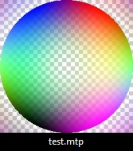

# MysticThumbs example plugin

## Add new image formats to MysticThumbs

## How to use

A Visual Studio 2022 project is supplied for convenience to get you up and running. This could be adapted to older versions if required as it is very rudimentary.
Use this example project as a template to make your own.

Make one plugin project for each file type.
If you require different file types create new plugins for each.
You register each file format extension necessary for the file format, so you can for example register multiple extensions such as JPEG has with .jpg, .jpeg etc. you could register extensions .mtp, .mtp1, .mtp2 etc.

The core interface that must be implemented is the `IMysticThumbsPlugin` interface. In this example the class `CExamplePlugin` implements this.

MysticThumbs can request any number of these objects so it is very important that you do not use any static variables that could cause conflicts amongst concurrent running objects. Encapsulate everything in your class.

The documentation and comments in the `MysticThumbsPlugin.h` header file specify all the required information that you will need to successfully implement your own plugin.

For the purposes of the example, we use the .mtp extension (which is actually the extension used for MysticThumbs plugin DLLs) and generate a test pattern image dynamically of the requested thumbnail size.

## IMysticThumbsPlugin::Ping and IMysticThumbsPlugin::GenerateImage methods

This is the meat of the plugin.

In a typical plugin you will read from the passed IStream interface pointer that points to the head of the file being thumbnailed.
The Ping method parses the file and returns information about the dimensions of the image.
The GenerateImage method reads the file and generates the thumbnail and returns the image data **un-scaled**.
It is not usually necessary to scale your image, and you can simply read and pass the full image back, this will yield the fastest and best results. MysticThumbs and Explorer will take care of scaling appropriate to control panel and operating system requirements. The desiredSize and flags parameters are merely hints should you require them.

If however, you are generating a thumbnail of an abstract nature, say for example a sound save form, then your image could be of any arbitrary size, and the desiredSize parameter can be used to determine the best size to render to.

The **desiredSize** parameter represents the size of the thumbnail that Explorer is requesting at the time, this could be for example 32, 48, 96, 256 or even very large if requesting for preview purposes. It is the **width** in pixels of the requested thumbnail.
The **flags** parameter gives you hints as to what the control panel settings are for your file extension, such as transparency, embedded thumbnail and scaling settings. This may be expanded upon in future releases.

## Building

Ensure you build for both x86 and x64 platforms. This ensures compatibility with 32 bit apps on 64 bit Windows.
The example project already has the required project set up.

The x86 plugin should end with 32.mtp and the x64 plugin should end with 64.mtp, for example ExamplePlugin32.mtp and ExamplePlugin64.mtp.

Place both these files in a plugins folder in the appropriate Plugins folder.

Shortcut buttons are available in the control panel plugins dialog that will open the folder for either the current user only (if using a shared machine and you want to either test or use a plugin only for yourself), or for all users, which will be the Plugins folder in the install folder.
Installing plugins for all users in the install folder will likely require administrator privileges.

Register the plugin in the [MysticThumbs control panel](https://mysticcoder.net/mysticthumbshelp/index.htm?context=60).

## Using

Use the [Plugins button](https://mysticcoder.net/mysticthumbshelp/index.htm?context=60#plugins), which opens the [Plugins dialog](https://mysticcoder.net/mysticthumbshelp/index.htm?context=150) where you can register and unregister plugins after installing them into the appropriate folder.

- Select the plugin from the drop list.
- Use the Register button to install the required Explorer hooks for the file extensions assigned to the plugin.
- Use the Unregister button to remove the hooks.

If the plugin loads successfully you will find it in the MysticThumbs control panel [File Format](https://mysticcoder.net/mysticthumbshelp/index.htm?context=60#fileformat) drop list under an entry corresponding to the name you return in the method `IMysticThumbsPlugin::GetName()`.
You can now use it just as you would any other natively supported file format with all the benefits of the control panel options.

## To test this example plugin:

- Build both Win32 and x64 Release configurations and place the resulting .mtp files in the MysticThumbs plugin folder.
- Create a dummy, empty file on your desktop called test.mtp
- Restart Explorer, for example using task manager.
- Provided the plugin loaded you should see the test pattern display for your test.mtp file that looks like this:

You now have all the MysticThumbs thumbnail options available for your file format!